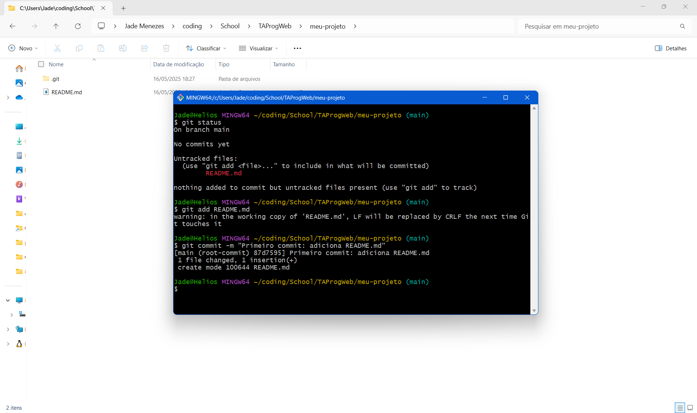

## 1. Configuração Inicial do Git

## 2. Criar um Repositório Local

### 1. Crie uma pasta para o projeto:

### 2. Inicialize um repositório Git:

## 3. Adicionar Arquivos e Fazer Commit

### 1. Crie um arquivo README.md:

### 2. Verifique o status do repositório:

### 3. Adicione o arquivo ao staging area:

### 4. Faça o primeiro commit:

## 4. Criar um Repositório no GitHub

### 1. Acesse o GitHub e crie um novo repositório:

### 2. Após criar o repositório, o GitHub fornecerá uma URL do repositório

## 5. Conectar o Repositório Local ao GitHub

### 1. Adicione o repositório remoto ao seu projeto local:

obs: fiz a configuração do meu git com ssh.

### 2. Envie as alterações locais para o GitHub:

## 6. Criar e Trabalhar em uma Nova Branch

### 1. Crie uma nova branch chamada feature/nova-funcionalidade:

### 2. Crie um novo arquivo na pasta, contendo algum texto:

### 3. Adicione e faça commit das alterações:

### 4. Envie a branch para o GitHub:

## 7. Fazer Merge da Branch na Main

### 1. Volte para a branch main:

### 3. Mescle a branch feature/nova-funcionalidade na main:

### 4. Envie as alterações para o GitHub:

